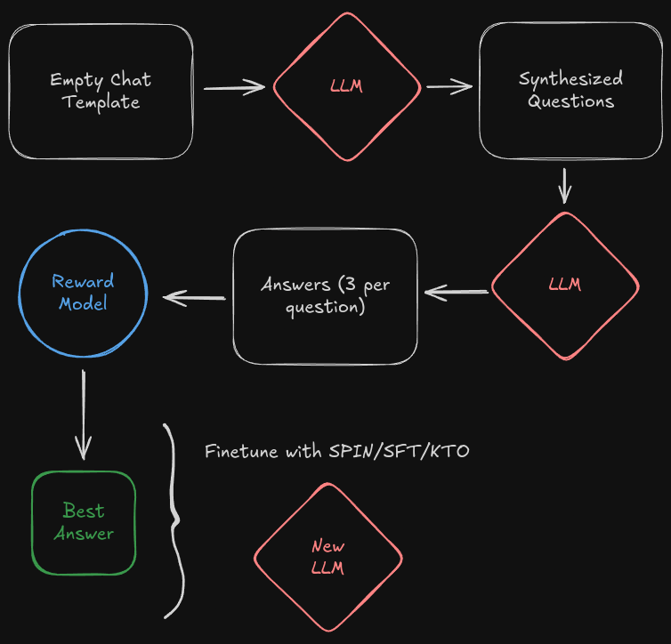

# OpenEndedLM: Open Ended Language Models to Self Improve

### A simplified diagram of the current recipe:

Here is the current recipe:

1. We sample questions with the empty chat template so that the LLM generates questions instead of answers as seen in [Magpie](https://arxiv.org/abs/2406.08464).
2. Then, we generate 3 responses per question (we sample 3 instead of 2 to increase the variability of the preference pairs).
3. We reward each response with a reward model, get the best and worst response to create a dpo training set.
4. After the dataset is done, we finetune our model with ORPO on the dataset we just synthesized.

We hope that this open ended system can refine its past knowlage as it samples data from it knowledge and rewards them.

More testing + r&d + paper coming soon!